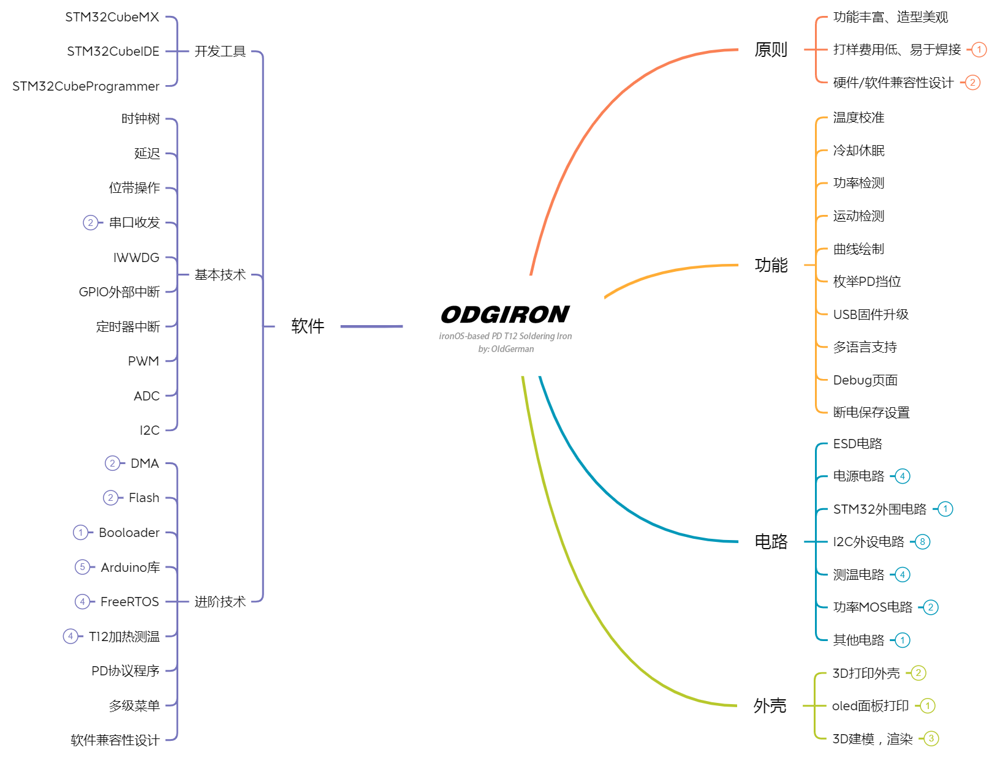
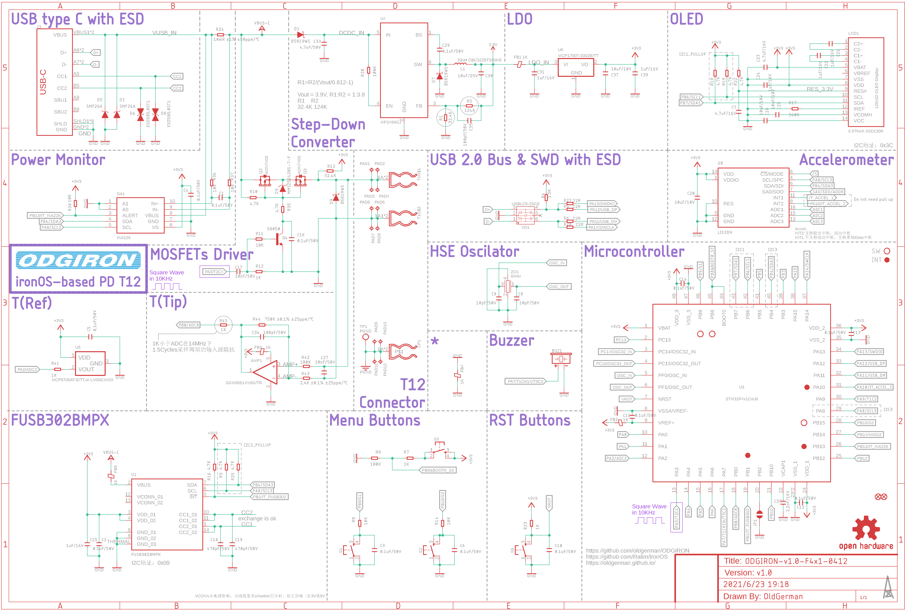
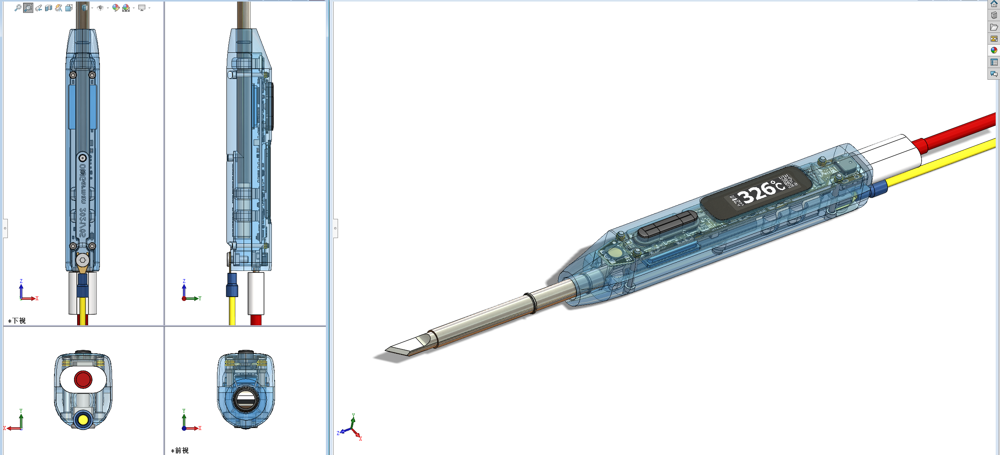

# ODGIRON

## 关于

> 这是一个很久以前的项目，仅内测了一批套件，现将其所有软硬件资料开源
>
> Github仓库链接：https://github.com/oldgerman/ODGIRON

开源USB-C PD T12电烙铁，基于HAL库开发，STM32CubeIDE + STM32CubeMX

固件从 [ironOS](https://github.com/Ralim/IronOS) 修改而来，运行FreeRTOS，更换了主控，重新设计了主界面和多级菜单，更大的oled显示屏，分辨率128x32

双面板设计，电阻电容最小0603封装，焊接难度比0402小

前期准备几乎兼容所有QFN48、RAM ≥ 20KB、FLASH ≥ 128KB 的STM32芯片，但后期发现 F103 固件写不下了遂停止维护，主力适配 F401，当然如果你有能力，可自行移植到其他型号上

## 技术大纲

## 成品

## 硬件

### 配置

- 主控：STM32F103CBU6、STM32F401CCU6
- 屏幕：0.87inch OLED，SSD1316 分辨率128x32
- PD协议芯片：FUSB302B
- 加速度计：LIS3DH
- 功率计：INA226
- 电源管理：MP2456 + LDO 3.3V
- 温度测量：SGM8551 + MCP9700AT
- 功率MOS：AON7403（-30V/-29A）*2
- 外壳：尼龙3D打印

### PCB

### 原理图

### 外壳

## 软件

[固件版本更新日志](https://github.com/oldgerman/ODGIRON/blob/master/Notes/firmware_logs.md)

[固件升级方法](https://github.com/oldgerman/ODGIRON/blob/master/Notes/firmware_upgrade.md)

### 功能

- :heavy_check_mark:功率计

- :heavy_check_mark:自动休眠、运动唤醒

- :heavy_check_mark:温度功率曲线绘制

- :heavy_check_mark:USB固件升级

- :heavy_check_mark:多级菜单（可配置的参数太多，只列举几个）

  - 温度校准
  - 冷却休眠
  - 枚举PD挡位
  - ...

- :heavy_check_mark:断电保存设置

- 待开发

  - 多语言支持（目前仅支持中文）

  - ...

### BUG

ADC注入通道测量尖端的温度：STM32F401CCU6偶尔会向上抖动10度，同样的代码在STM32F103CBU6跑却很稳定，可能是ADC时钟频率、采样周期、转换周期不同导致，目前整不好了，但影响不大:)

## 致谢

> 感谢[@Miniware](http://www.miniware.com.cn/)开源的[TS100资料](http://www.minidso.com/forum.php?mod=viewthread&tid=892)
>
> 感谢[@Ralim](https://github.com/Ralim)开发的[ironOS](https://github.com/Ralim/IronOS)
>
> 感谢[@olikraus](https://github.com/olikraus)开发的[u8g2](https://github.com/olikraus/u8g2)
>
> 感谢[@Zanduino](https://github.com/Zanduino)开发的[INA](https://github.com/Zanduino/INA)

