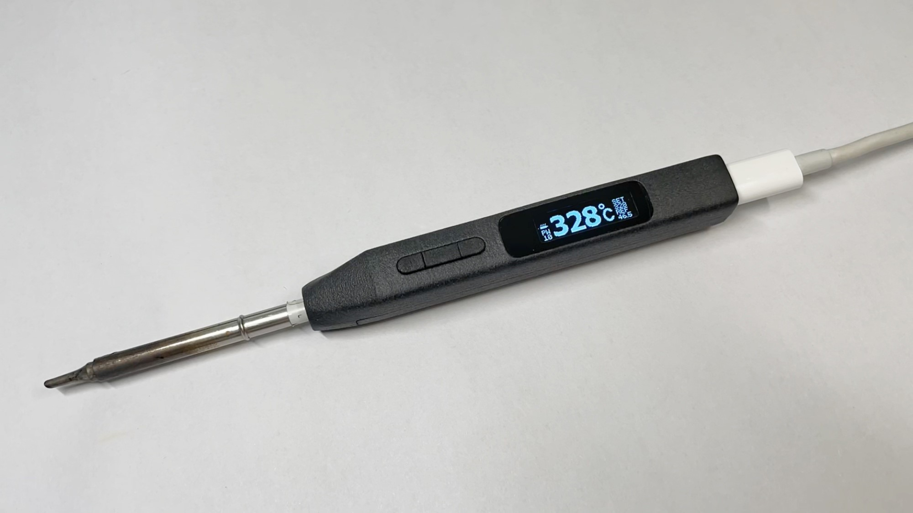
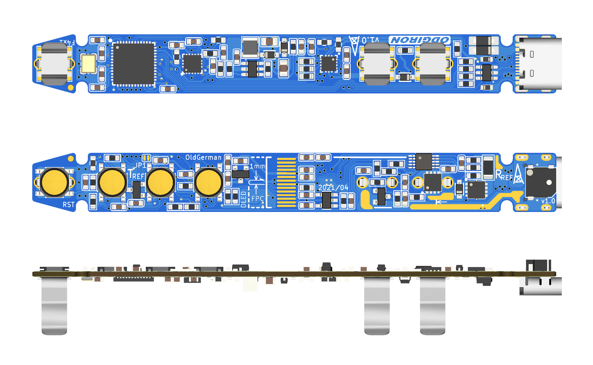
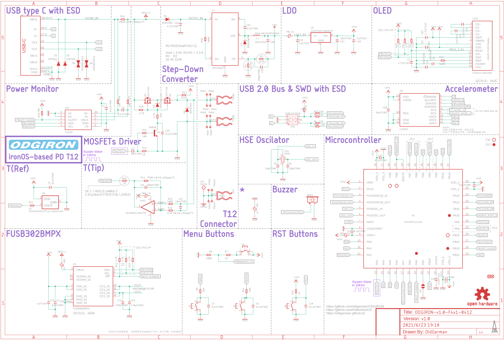

# ODGIRON

>开源PD T12便携电烙铁
>
>基于[ironOS](https://github.com/Ralim/IronOS)，运行FreeRTOS
>
>基于HAL库开发，STM32CubeIDE + STM32CubeMX
>
>全新设计的主界面和多级菜单，更大的oled显示屏，分辨率128x32
>
>双面板设计，电阻电容最小0603封装，焊接难度比0402小
>
>几乎兼容所有QFN48、RAM ≥ 20KB、FLASH ≥ 128KB 的STM32芯片（目前兼容STM32F103CBU6、STM32F401CCU6）

## 硬件

### 配置

- 主控：STM32F103CBU6、STM32F401CCU6
- 屏幕：0.87inch OLED，SSD1316 分辨率128x32
- PD协议芯片：FUSB302B
- 加速度计：LS3DH
- 功率计：INA226
- 电源管理：MP2456 + LDO 3.3V
- 温度测量：SGM8551 + MCP9700AT
- 功率MOS：AON7403（-30V/-29A）*2
- 外壳：尼龙3D打印

### PCB

### 原理图

## 软件

### 功能

- :heavy_check_mark:功率检测

- :heavy_check_mark:运动唤醒

- :heavy_check_mark:曲线绘制

- :heavy_check_mark:USB固件升级

- :heavy_check_mark:多级菜单（可配置的参数太多，只列举几个）

  - 温度校准
  - 冷却休眠
  - 枚举PD挡位
  - ...

- :heavy_check_mark:断电保存设置

- 待开发

  - 多语言支持（目前仅支持中文）

  - ...

### 亟待解决的BUG

ADC注入通道测量尖端的温度：STM32F401CCU6偶尔会向上抖动10度，同样的代码在STM32F103CBU6跑却很稳定，可能是ADC时钟频率、采样周期、转换周期不同导致，目前真整不好了:)

## 成品演示

## 致谢

> 感谢[@候捷](http://boolan.com/jjhou/)的[C++体系视频](http://boolan.com/jjhou/)及翻译的C++系列丛书
> 感谢[@李建忠](https://www.bilibili.com/video/BV1kW411P7KS)的[设计模式视频](https://www.bilibili.com/video/BV1kW411P7KS)

> 感谢[@Alex2](https://www.radiokot.ru/forum/viewtopic.php?t=157765)和[@GFX](https://www.radiokot.ru/forum/viewtopic.php?f=25&t=157765&start=40)开发的[Измеритель uRLC](https://www.radiokot.ru/artfiles/6435/)
> 感谢[@zwei13](https://www.yleee.com.cn/space-uid-1637.html)提供入坑STM32的[Nucleo](https://www.st.com/zh/evaluation-tools/stm32-nucleo-boards.html#overview)
> 感谢[@正点原子](http://www.alientek.com/)的[保姆级STM32学习资料](http://www.openedv.com/docs/)
> 感谢[@Miniware](http://www.miniware.com.cn/)开源的[TS100资料](http://www.minidso.com/forum.php?mod=viewthread&tid=892)

> 感谢[@Jan--Henrik](https://github.com/Jan--Henrik)开发的[Otter-Iron](https://github.com/Jan--Henrik/Otter-Iron)
> 感谢[@Ralim](https://github.com/Ralim)开发的[ironOS](https://github.com/Ralim/IronOS)
> 感谢[@Clara Hobbs](https://hackaday.io/clarahobbs)]开发的[PD-buddy](https://git.clayhobbs.com/pd-buddy/pd-buddy-firmware)
> 感谢[@_VIFEXTech](https://github.com/FASTSHIFT)开发的[Arduino-For-Keil](https://github.com/FASTSHIFT/Arduino-For-Keil)
> 感谢[@olikraus](https://github.com/olikraus)开发的[u8g2](https://github.com/olikraus/u8g2)
> 感谢[@Zanduino](https://github.com/Zanduino)开发的[INA](https://github.com/Zanduino/INA)

> 感谢[@深圳嘉立创](https://www.jlc.com/)的[PCB打样](https://www.jlc.com/newOrder/client/index.html#/pcb/pcbPlaceOrder?x=668.7900656013843&quoteOnline=yes)、[3D打印](https://www.sanweihou.com/placeOrder)、[面板打印](https://dos.szlcsc.com/dos/panel/print.html)

