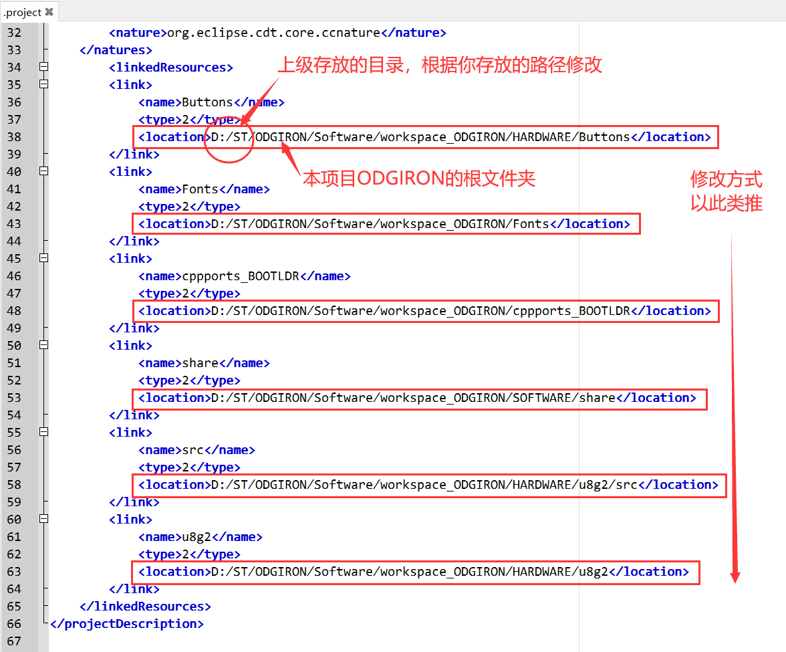

## 开发环境

本文件夹是使用STM32CubeIDE_1.7创建的workspace

使用Darkest Dark主题，未安装的STM32CubeIDE直接打开CDT编辑器的颜色会很奇怪，[推荐食用方式](https://blog.csdn.net/qq_42038029/article/details/99735688?utm_medium=distribute.pc_relevant.none-task-blog-title-2&spm=1001.2101.3001.4242)

## Link 文件夹路径丢失修复

由于本项目多个PROJECT_STM32XXX工程共用上级目录的源代码文件，而STM32CubeIDE似乎只能通过Link文件夹的方式让多个工程共享同一源代码文件，大家将本项目存放在自己电脑的位置又不一样，因此会存在Link 文件夹路径丢失无法正常编译的问题，解决方法如下：

打开代码PROJECT_STM32XXX工程文件夹下的.project文件，将字段`<location>`内的路径根据你实际存放的路径修改：

重新编译就OK了

